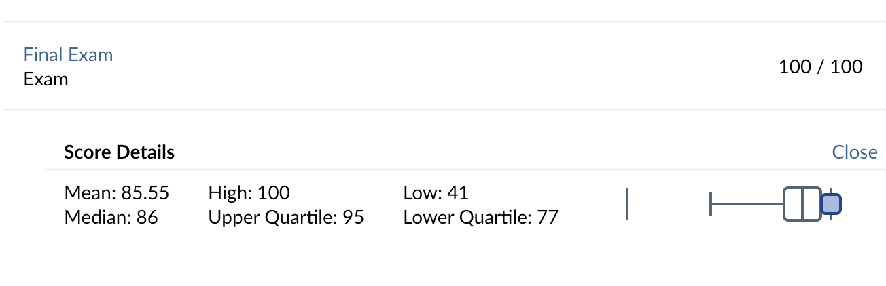
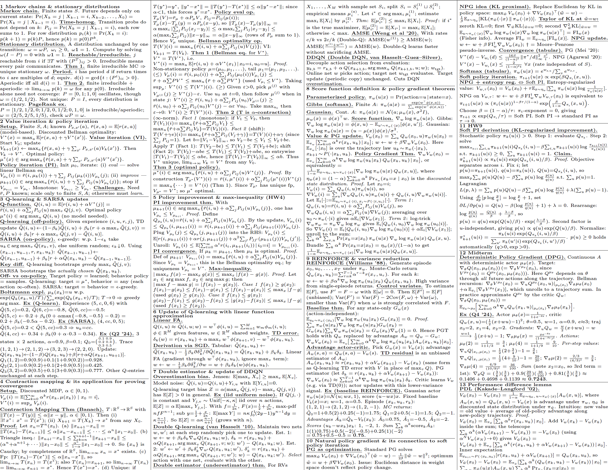

# UMich ECE 567 Cheat Sheet

This repository contains a final exam cheat sheet for **UMich ECE 567: Reinforcement Learning Theory**.

Using this cheat sheet, I received a **100/100 score** on the final exam in **Winter 2026**.

## Files

This repository includes both the LaTeX source code and the compiled PDF version of the cheat sheet:

- [LaTeX source code](./main.tex)
- [Compiled PDF](./main.pdf)

## Preview

## Formatting

The cheat sheet is written in LaTeX and formatted for the standard U.S. **Letter** paper size.

It uses a landscape layout with **zero margins** and an extremely compact design to maximize the amount of useful content that fits on the page.

The compiled LaTeX output is **two pages** in total, which can be printed on the **front and back of a single sheet** of paper.

## Topics Covered

The cheat sheet covers the following topics:

- Markov chains and stationary distributions
- Value iteration and policy iteration algorithms
- Q-learning and SARSA updates
- Definition of contraction mapping and application of contraction mapping for proving convergence
- Update of Q-learning with linear function approximation
- Double estimator and update of DDQN
- Score function definition and policy gradient theorem
- REINFORCE and variance reduction
- Natural policy gradient and its connection to soft policy iteration
- Performance difference lemma
- UCB algorithm for multi-armed bandits
- MCTS for Alpha-Zero
- Potential-based reward shaping
- DPO and DPO loss
- Zeroth-order optimization
- Contrastive learning
- Relative value function and Blackwell optimality
- Duality and KKT conditions

## Disclaimer

This cheat sheet was created for personal study and review for UMich ECE 567. It is not an official course document.